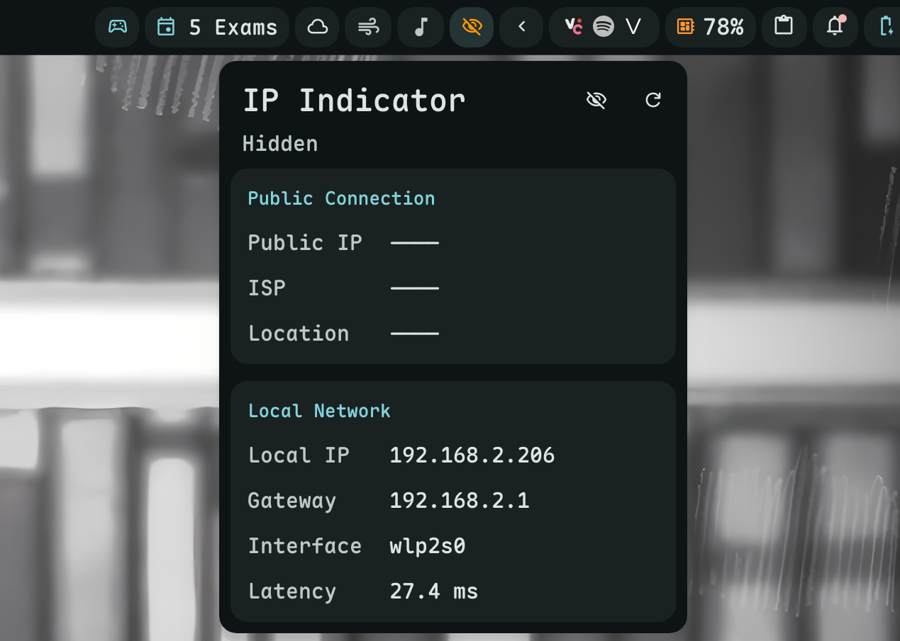

# IP Indicator

Display your public IP, ISP, and location.



## Install

**Required:** This plugin requires [dms-common](https://github.com/hthienloc/dms-common) to be installed.

```bash
# 1. Install shared components
git clone https://github.com/hthienloc/dms-common ~/.config/DankMaterialShell/plugins/dms-common

# 2. Install this plugin
dms plugins install ipIndicator
```

Or manually:

```bash
git clone https://github.com/hthienloc/dms-ipIndicator ~/.config/DankMaterialShell/plugins/ipIndicator
```

> **Note:** `dms-common` is a shared dependency required by this plugin. Install it first if you're cloning manually. The plugin manager handles this automatically.

## Features

- **IP info at a glance** - Country flag, IP address, ISP
- **Privacy mode** - Click the eye button in popout header to hide/show IP
- **Quick Refresh** - Right-click the bar icon to quickly refresh network status
- **Smart VPN Detection** - Automatically detects active VPN/proxy interfaces (tun, tap, wg, ppp)
- **Latency Monitor** - Integrated ping tool to measure real-time latency to DNS servers
- **Local IP Details** - Local IP, gateway, and interface name in the popout
- **Service Redundancy** - Failover across 3 IP geolocation providers (ip-api.com, ipinfo.io, ifconfig.me)
- **IP Change Notifications** - Optional desktop notifications when your IP or ISP changes

## Usage

| Action | Result |
|--------|--------|
| Left click | Open details popout |
| Right click | Refresh network status |

## Requirements

- `curl` - HTTP requests to ip-api.com

## License

GPL-3.0

## Done

- [x] Smart VPN Detection
- [x] Latency Monitor
- [x] Local IP Details
- [x] Service Redundancy
- [x] IP Change Notifications